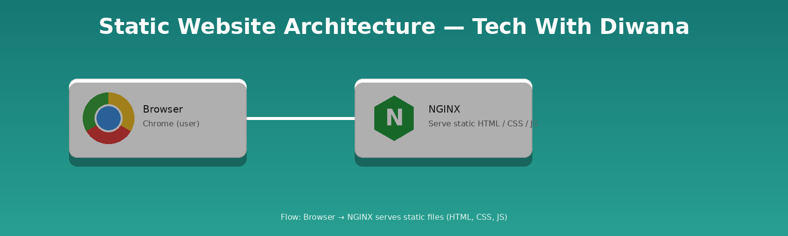
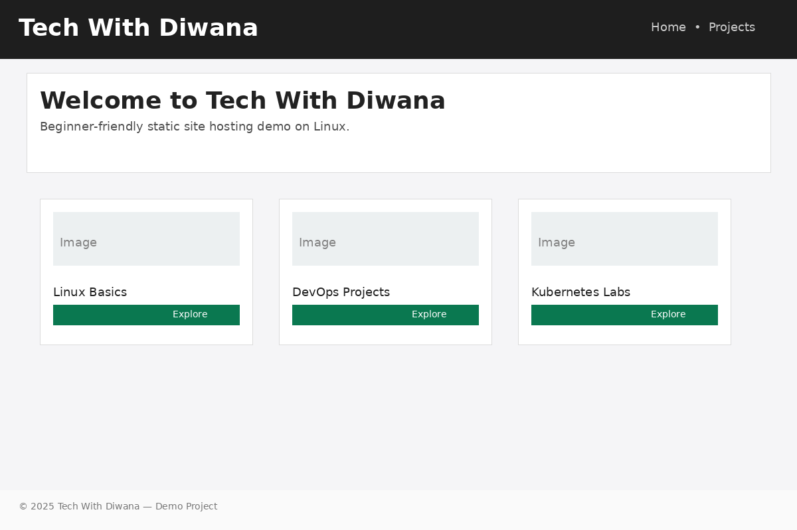

# 🌐 Tech With Diwana — Static Website Demo

[](https://github.com/techwithdiwana/techwithdiwana_static_site)
[](https://github.com/techwithdiwana/techwithdiwana_static_site/commits/main)
[](./LICENSE)
[](https://github.com/techwithdiwana/techwithdiwana_static_site)

[](https://youtube.com/@techwithdiwana)
[](https://youtube.com/@techwithdiwana)

---

## 🔭 About
This repository contains a beginner-friendly static website demo for **Tech With Diwana**.  
Built with simple **HTML / CSS / JS** and designed to teach static site hosting with **NGINX** on Ubuntu / EC2.

---

## 🏗 Architecture
Browser → **NGINX** → Serve static files (`index.html`, `css/`, `js/`, `assets/`)



---

## 🖥 First Page Preview



---

## 🚀 Quick deploy (Ubuntu / EC2 / WSL) — safe steps

> **Important:** These steps are safe for beginners (no `rm -rf` used).

1. Connect to your server (replace `your-key.pem` and IP):
```bash
ssh -i "your-key.pem" ubuntu@<EC2-PUBLIC-IP>

2. Install Nginx & Git:

sudo apt update
sudo apt install -y nginx git

3. Create webroot & clone repo:

sudo mkdir -p /var/www/techwithdiwana
sudo git clone https://github.com/techwithdiwana/techwithdiwana_static_site.git /var/www/techwithdiwana

4. Set permissions:

sudo chown -R www-data:www-data /var/www/techwithdiwana
sudo find /var/www/techwithdiwana -type d -exec chmod 755 {} \;
sudo find /var/www/techwithdiwana -type f -exec chmod 644 {} \;

5. Create Nginx site config /etc/nginx/sites-available/techwithdiwana:

server {
  listen 80;
  server_name <EC2-PUBLIC-IP>;

  root /var/www/techwithdiwana;
  index index.html;

  location / {
    try_files $uri $uri/ =404;
  }

  location ~* \.(png|jpg|jpeg|svg|css|js)$ {
    expires 7d;
    add_header Cache-Control "public";
  }
}

6. Enable site & reload Nginx:

sudo ln -sf /etc/nginx/sites-available/techwithdiwana /etc/nginx/sites-enabled/techwithdiwana
sudo rm -f /etc/nginx/sites-enabled/default
sudo nginx -t
sudo systemctl reload nginx

7. Open in browser:

http://<EC2-PUBLIC-IP>

📂 Project structure

techwithdiwana_static_site/
├── assets/
├── css/
├── js/
├── index.html
└── README.md

💬 How to contribute

1. Fork this repo.

2. Clone your fork locally:

git clone https://github.com/<your-user>/techwithdiwana_static_site.git

3. Create a branch, make changes, commit, push and open a PR:

git checkout -b feature/your-change
git add .
git commit -m "Describe your change"
git push origin feature/your-change

🖥 Live Demo

If you host this repo on GitHub Pages / or on a server, add the demo URL here:
Demo: http://<your-ec2-ip> or https://your-domain.com

---
## 🛡 License

This project is MIT licensed — see [LICENSE](./LICENSE).

---

## 👨‍🏫 Author & Contact
**Tech With Diwana**

- [YouTube](https://youtube.com/@techwithdiwana)  
- [Email](mailto:techwithdiwana@gmail.com)

---

## ✅ LICENSE File (MIT)

Create a file called `LICENSE` in the root of repo with this content:

```text
MIT License

Copyright (c) 2025 Tech With Diwana

Permission is hereby granted, free of charge, to any person obtaining a copy
of this software and associated documentation files (the "Software"), to deal
in the Software without restriction, including without limitation the rights
to use, copy, modify, merge, publish, distribute, sublicense, and/or sell
copies of the Software, and to permit persons to whom the Software is
furnished to do so, subject to the following conditions:

The above copyright notice and this permission notice shall be included in all
copies or substantial portions of the Software.

THE SOFTWARE IS PROVIDED "AS IS", WITHOUT WARRANTY OF ANY KIND, EXPRESS OR
IMPLIED, INCLUDING BUT NOT LIMITED TO THE WARRANTIES OF MERCHANTABILITY,
FITNESS FOR A PARTICULAR PURPOSE AND NONINFRINGEMENT. IN NO EVENT SHALL THE
AUTHORS OR COPYRIGHT HOLDERS BE LIABLE FOR ANY CLAIM, DAMAGES OR OTHER
LIABILITY, WHETHER IN AN ACTION OF CONTRACT, TORT OR OTHERWISE, ARISING FROM,
OUT OF OR IN CONNECTION WITH THE SOFTWARE OR THE USE OR OTHER DEALINGS IN THE
SOFTWARE.

